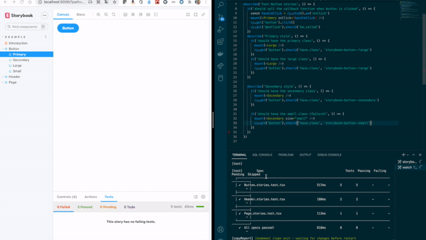

# Application with Storybook + Cypress

## Motivation

I am a big fan of [Storybook](https://storybook.js.org/) and the [addon Jest](https://storybook.js.org/addons/@storybook/addon-jest/) which is a really beautiful addon. I like also Cypress along with its great test ecosystem. I appreciate all ways which can combine the both tools. Besides when I read this [article](https://www.cypress.io/blog/2021/05/19/cypress-x-storybook-2-0/), I found it wonderful they managed to link the two worlds. Now I would like to see directly in the story the related tests. With the [addon Jest](https://storybook.js.org/addons/@storybook/addon-jest/), we can already do that if you have jest tests. But none addon works the same with mocha tests (where Cypress is based). Rather than write a fork of this amazing addon, it will more convenient to write a converter of Mocha report to Jest report 🙂.

## Use Mochawesome reporter in Cypress

1. Install the cypress-mochawewome-reporter. Refer to the [readme](https://www.npmjs.com/package/cypress-mochawesome-reporter) for the installation

2. Update the cypress config to add this reporter

```json
{
    ...
    "reporter": "cypress-mochawesome-reporter"
}
```

3. Copy the generated report into a safe place

Since the report is deleted and generated again at each test, it should be persisted between test. We can do it with a simple script in the **package.json**

```json
 "copyReport": "cp cypress/reports/html/index.json src/stories/reports/mochawesome.json",
```

4. Add a test script in your package.json

```json
 "test": "cypress run"
```

Or if you are using component testing.

```json
 "test": "cypress run-ct"
```

You can try by running the test command to see the generated report and then execute `yarn copyReport` to initialize the report.

## Install addon Jest in storybook

### 1. Install with yarn (or npm)

```sh
yarn add -D @storybook/addon-jest
```

### 2. Link your Cypress tests to your story

Let's assume you have a [Button story](src/stories/Button.stories.tsx) and its related test [Button.stories.test.tsx](src/stories/Button.stories.test.tsx). You can import the test results like this.

```ts
// import the module
import convertToJestReport from 'mochawesome-to-jest'
// import the mochawesome result depending where you have specified the reportDir
import mochaTestResults from './reports/mochawesome.json'
// import the addon-jest
import { withTests } from '@storybook/addon-jest'
// convert the mocha report to jest report
const results = convertToJestReport(mochaTestResults)
export default {
  title: 'Example/Button',
  component: Button,
  argTypes: {
    backgroundColor: { control: 'color' },
  },
  // enable the decorator
  decorators: [withTests({ results })],
}
```

> The report file `./reports/mochawesome.json` must exist otherwise you will face to an error. So I suggest you to create an empty json file `{}`.

### 3. Run storybook

You should have a `storybook` script in your package.json. If not, you can add it with:

```json
"storybook": "start-storybook -p 6006"
```

Then you can execute

    yarn storybook

### 4. In Dev mode

When you are modifing your component, you use to see your changes reflecting into your stories. You may want to see in the same time if you are broken your tests.
What suggest the [addon Jest](https://github.com/storybookjs/storybook/tree/main/addons/jest#generating-the-test-results) is to execute Jest in watch mode.
Unfortunately Cypress does not have a watch option when running the command line.

But you can overpass that with the package [npm-watch](https://github.com/M-Zuber/npm-watch).

#### Install npm-watch

    yarn add -D npm-watch

Add the following lines in your package.json

```json
  "watch": {
    "test": {
      "patterns": [
        "src"
      ],
      "extensions": "ts,tsx,css"
    },
    "copyReport": "cypress/reports/html/index.json"
  },
```

It specify which extensions to watch to perform the test and execute the `copyReport` script when the cypress report is generated.

#### Execute npm-watch

    yarn npm-watch

Now every changes on `src/**.(tsx?|css)` will launch the tests and copy the report

#### See it in action


